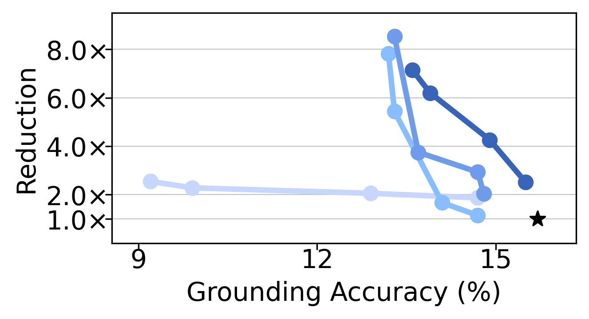

# ['25 VLDB] Déjà Vu: Efficient Video-Language Query Engine with Learning-based Inter-Frame Computation Reuse
This repository contains artifact for the paper "Déjà Vu: Efficient Video-Language Query Engine with Learning-based Inter-Frame Computation Reuse".

## Table of Contents
1. [Prerequisites](#1-prerequisites)
2. [Downloading videos](#2-downloading-videos)
3. [Transcode videos](#3-transcode-videos)
4. [Extracting input features for training](#4-extracting-input-features-for-training)
5. [Extracting compressed features](#5-extracting-compressed-features)
6. [Training ReuseViT](#6-training-reusevit)
7. [Extracting ReuseViT and baselines for Testing](#7-extracting-reusevit-and-baselines-for-testing)
8. [Running end tasks](#8-running-end-tasks)
   - [Original](#8-1-original)
   - [ReuseViT](#8-2-reusevit)
   - [Diffrate](#8-3-diffrate)
   - [Eventful](#8-4-eventful)
   - [CMC](#8-5-cmc)
9. [Plotting graph](#9-plotting-graph)

### 1. Prerequisites
#### 1-1. Clone and build docker image
```
git clone https://github.com/anonymous-dejavu/dejavu
cd docker
./build.sh
```

#### 1-2. Lanuch docker container
We require large amount of storage to store the extracted features, so we recommend launching docker containers with mounting option.
```
# refer to the example script to launch docker container
./launch.sh
```

#### 1-3. Set root of the path
From this point on, we assume the code is running inside the docker container.
```
cd /workspace/configs/paths
vim data.yaml
```
Set `data_dir` to your desired path, the storage should be larger than 2TB.

## Preparing Datasets
### 2. Downloading videos
Download the NextQA dataset from the official [NextQA repository](https://github.com/doc-doc/NExT-QA).
Place them under `${data_dir}/datasets/nextqa/videos`.
```
mkdir -p ${data_dir}/datasets/nextqa/videos
cd ${data_dir}/datasets/nextqa/videos
unzip NExTVideo.zip
ls # Should show 0000/ 0001/ 0002/
```

### 3. Transcode videos
```
cd /workspace
python -m src.scripts.transcode dry_run=false
python -m src.scripts.transcode split=val dry_run=false
python -m src.scripts.transcode split=test dry_run=false
```

### 4. Extracting input features for training
```
cd /workspace
python -m src.scripts.extract dry_run=false
python -m src.scripts.extract split=val dry_run=false
python -m src.scripts.extract split=test target_features=\'i,o\' num_gpus=4 num_workers=32 dry_run=false
```

### 5. Extracting compressed features
```
cd /workspace
python -m src.scripts.extract_compressed dry_run=false
python -m src.scripts.extract_compressed split=val dry_run=false
python -m src.scripts.extract_compressed split=test dry_run=false 
```

Check if dataset info is populated correctly
```
python -m src.data.components.nextqa +split=train +fps=2 +base_model_name=openai/clip-vit-large-patch14 +return_compressed=true +regenerate_dataset_info=false
python -m src.data.components.nextqa +split=val +fps=2 +base_model_name=openai/clip-vit-large-patch14 +return_compressed=true +regenerate_dataset_info=false
python -m src.data.components.nextqa +split=test +fps=2 +base_model_name=openai/clip-vit-large-patch14 +return_compressed=true +regenerate_dataset_info=false
```

### 6. Training ReuseViT
One can train the ReuseViT oneself, or use the checkpoint we provide.
#### 6-1. Training from scratch
```
items=(0.95 0.9 0.85 0.8)
for item in "${items[@]}"; do
    python src/train.py model.compile=true experiment=nextqa model.loss.target_reuse_rate=${item} model.dry_run=false
done
```

#### 6-2. Checkpoints
 - [ReuseViT checkpoints](https://drive.google.com/drive/folders/1WmD7kqUI_mi5RFmFQWYI6CBYizX9PFrh?usp=drive_link)

 Place the checkpoints under `${data_dir}/checkpoints/nextqa`.
 ```
 mkdir -p ${data_dir}/checkpoints/nextqa
 # Download the checkpoints and place them under ${data_dir}/checkpoints/nextqa
 ls ${data_dir}/checkpoints/nextqa # should look like nexqa-68.ckpt nextqa-85.ckpt nextqa-93.ckpt nextqa-95.ckpt
 ```

### 7. Extracting ReuseViT and baselines for Testing
#### 7-1. ReuseViT
```
cd /workspace
items=(68 85 93 95)
for item in "${items[@]}"; do
    python src/eval.py experiment=nextqa-hard-${item} model.dry_run=false data.test_split=test &
done
```

#### 7-2. DiffRate
For running the DiffRate, one should train the model to determine the pruning and merging decision.
For now, we provide the log we trained [here](https://drive.google.com/file/d/1jD_UbS5lPeQ7DSQ47JRJukgNihUx6D63/view?usp=drive_link), and plan on sharing the code to train DiffRate.
```
mkdir -p ${data_dir}/checkpoints/diffrate
tar xvzf nextqa.tar.gz -C ${data_dir}/checkpoints/diffrate
```

```
items=('31.0' '34.7' '38.5' '42.3' '46.1')
for item in "${items[@]}"; do
    python -m src.scripts.extract mode=diffrate split=test target_features=o num_gpus=4 num_workers=24 batch_size=16 +diffrate_flops=${item} dry_run=false
done
```

#### 7-3. Eventful
```
for k in $(seq 1 15); do
    python src/eval.py experiment=eventful reuse_module.decision.k=$((k*10)) model.dry_run=false &
done
```

#### 7-4. CMC
```
for k in $(seq 3 3 45); do
    python src/eval.py experiment=cmc reuse_module.decision.threshold=-$k model.dry_run=false data.test_split=test &
done
```

### 8. Running end tasks
First, build docker container for running the end tasks.
```
cd docker/next-gqa
./build.sh
./launch.sh
```
We assume the following commands are run inside the docker container.

##### 8-1. Original
```
cd /workspace/third_parties/NExT-GQA/code/TempGQA

# Original
CUDA_VISIBLE_DEVICES=0 ./shells/next_test_dual.sh original 2>&1 | tee log_original.txt &
```

##### 8-2. ReuseViT
```
items=('68' '85' '93' '95')
for item in "${items[@]}"; do
    ./shells/next_test_dual.sh reuse-$item 2>&1 | tee log_reuse-$item.txt &
done
```

#### 8-4. Eventful
```
items=$(seq 1 15)
for item in "${items[@]}"; do
    ./shells/next_test_dual.sh eventful-$((item*10)) 2>&1 | tee log_eventful_$item.txt &
done
```

#### 8-5. CMC
```
items=$(seq 3 3 45)
for k in "${items[@]}"; do
    ./shells/next_test_dual.sh cmc-$threshold 2>&1 | tee log_cmc_$threshold.txt &
done
```

### 9. Plotting graph
```
cd /workspace/scripts
python plot_nextqa.py
```
After running the code, one should be able to see the results like the following.

